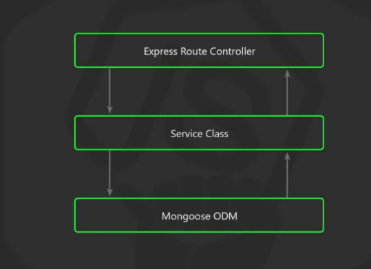

# Crypto Currencies Monitor API


## Descripción 📚

Este proyecto es una API desarrollada con Express como wrapper de [CoinGecko](https://www.coingecko.com/en/api),
con algunas funcionalidades como:

    - Registro de usuarios
    - Autenticación de usuarios
    - Agregar Crypto Currencies al perfil del usuario
    - entre otros...

## Quick Start 🔥

1. La forma más sencilla para inicializar el proyecto es utilizando docker.
Este simulará el entorno de producción. Para correr el proyecto junto con 
su base de datos, ejecute el siguiente comando desde la carpeta root

```shell
    $ docker-compose up
```

2. Como segunda opción, se pueden cambiar las variables de entorno
en el archivo <strong>.env.development </strong> con los datos de la 
conexión a la base de datos, y posteriormente ejecutar los siguientes comandos.

```shell
    $ npm install
```

Para entorno de desarrollo

```shell
    $ npm run dev
```

Para simular un entorno de producción

```shell
    $ npm run prod
```
<br>
<br>

# Tests 🧪

## Preparar entorno 🎯

Para una configuración rápida, el proyecto incluye un archivo para ejecutar una base de datos de pruebas 
usando ....🐳 docker. Este a diferencia del otro archivo docker-compose.yml, es totalmente efímero,
ya que no tiene un volume asociado, por lo que luego de que el contenedor se detenga o sea eliminado,la información de la base de datos desaparecerá.

Para inicializar la base de datos, solo se debe ejecutar el siguiente comando.

```shell
 $ docker-compose -f docker-compose.test.yml up -d
```

## Correr los Tests 🏃‍♀️

Ahora, para ejecutar los test, con el comando

```shell
    $ npm run test
```

## Covertura de los tests

Para visualizar el nivel de cobertura de las pruebas,
hay dos opciones para tener esta información

1. Resultados por consola

```shell
    $ npm run test:cover
```

2. Reporte HTML

```shell
    $ npm run test:report
```
<br>
<br>

# Documentación de los Endpoints

Para este propósito se utilizó OpenAPI junto con Swagger, por lo que para tener acceso 
a la documentación de los enpoint,lo primero es ejecutar el proyecto en entorno de desarrollo.

```shell
    $ npm run dev
```

Luego se podra visualizar en la siguiete ruta

- http://localhost:3000/docs

<br>
<br>

# Descripción Tecnica

El proyecto construido con TypeScript, ya que a diferencia de JavaScript puro y duro, este 
da algunas caracteristicas muy utiles como poder escribir código con menos errores, más sencillo,
coherente y fácil de probar.

<br>
<br>

## Estructura de carpetas

```
src
  |
  |_config
  |      |
  |      |_connection
  |      |_env
  |      |_error
  |      |_middleware
  |      |_server
  |
  |_modules
  |       |
  |       |_module/component
  |                   |
  |                   |_response
  |                   |_request
  |                   |_index.ts
  |                   |_module.interface.ts
  |                   |_module.service.ts
  |                   |_module.validation.ts
  |
  |_routes
  |
  |_test
  |
  |_ app.ts
```



El proyecto sigue un patrón de diseño muy parecido al de la imagen, sin embargo,no sin la típica estructura donde se suelen colocar todas las rutas, servicio,y capa de acceso a dato en las mismas carpetas. Este está enfocado a que cada módulo/componente, este junto con todo
referente a este,esto con el fin de que cuando se requiera hacer un cambio en alguno de los archivos 
será mucho más fácil de entender hablando en el contexto de lógica de negocio.

Este patrón también es muy útil y fácil de escalar en otros patrones de diseño 
como DDD y arquitectura en microservicios, como se muestra en el siguiente ejemplo.

```
src
  |
  |_ modules
           |
           |_ Auth
           |    |_application
           |    |
           |    |_domain
           |    |
           |    |_infraestructure
           |
           |_ Customer
                |_application
                |
                |_domain
                |
                |_infraestructure
```